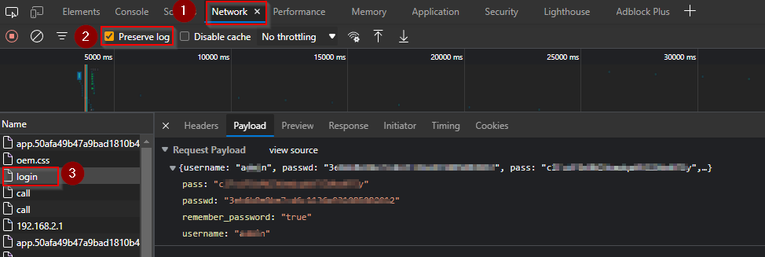
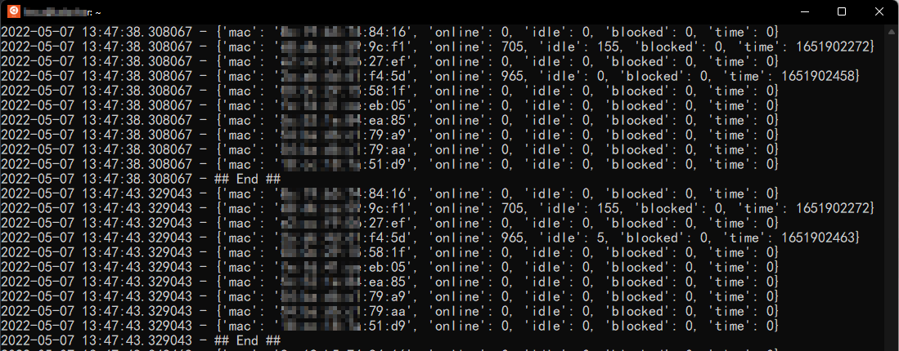
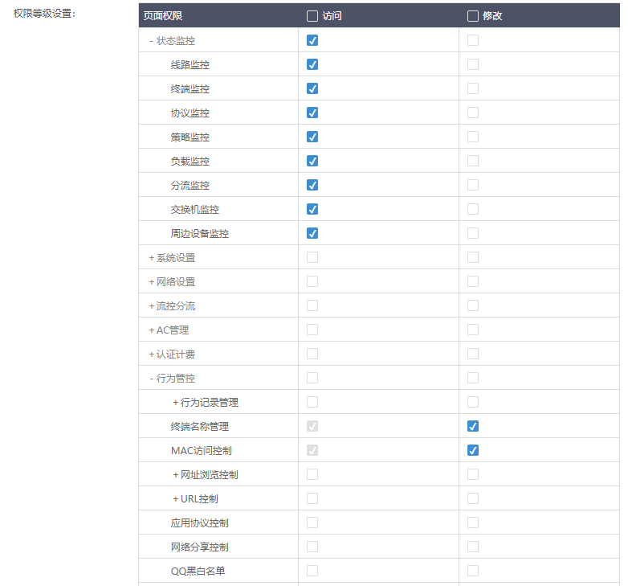

# iKuai 爱快软路由 上网时长守护程序

## 主要功能
- 根据条件，监控满足条件的所有终端设备上线时间
- 如果达到或超过所设置的上线时长`maxOnlineTime`(默认50分钟)，则断网一段时间`maxBlockedTime`(默认10分钟)
  - 如果上线未达到`maxOnlineTime`，并且设备无网络活动时长达到`maxIdleTime`(默认5分钟)，则重置设备上线状态
  - 如果上线未达到`maxOnlineTime`，并且设备无网络活动时长**尚未**达到`maxIdleTime`(默认5分钟)，然后有新的网络活动，则`idle`时长会累加到`online`时长中

未实现：
- 明文密码登录功能未实现。需要自行抓取`passwd`字符串用以登录。


## 快速开始

### 登录
修改`login.json`文件，将`username`, `passwd`, `pass`设置成你设备接收的值。

```json
{
    "username": "user",
    "passwd": "xxxxxxxxxxxxxxxxxxxxxxxxxxxxxxxx",
    "pass": "xxxxxxxxxxxxxxxxxxxx",
    "remember_password": ""
}
```

获取方法：
- 打开爱快登录界面，输入用户名密码不要登录
- Edge 或者 Chrome 浏览器，按`F12` 进入 DevTool - Network，勾选 `preserve log`
- 点击登录按钮
- 找到 `login` - `payload`
    

### 运行
Linux:
```bash
python3 -O start.py
```

Windows:
```batch
python -O start.py
```

### 示例


## 字段说明
- mac: 设备 mac 地址
- online: 累计上线时长
- idle: 无网络活动时长。当设备网速小于阈值`onlineThreshold`时，被认为idle；超过阈值后，idle清零。
- blocked: 设备禁止联网的时间戳。为0表示未被禁止联网。
- time: 上次设备出现时间。如果为0，则表示设备没有接入WiFi或者长时间不活动，爱快认为下线。
  - 如果 `当前时间 - time` 超过 `maxOfflineTime`(默认5分钟)，则重置设备在线状态（所有属性清零）。

## 安全提示

### 最小权限
可以在爱快中新建一个账号，最小权限如下
- 状态监控（仅访问）
- 行为管控
  - 终端名称管理（修改）
  - MAC访问控制（修改）


